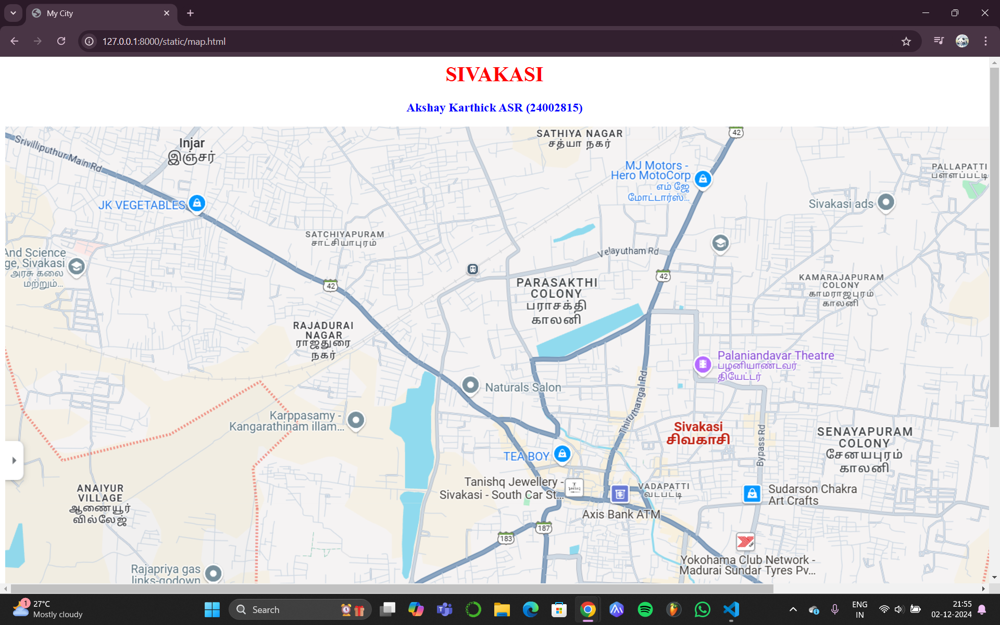
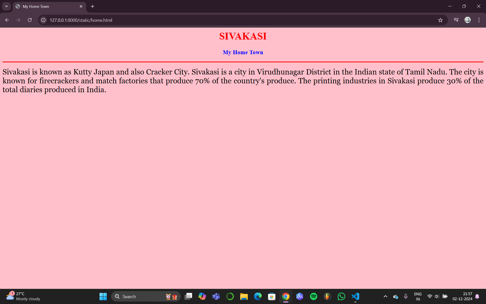
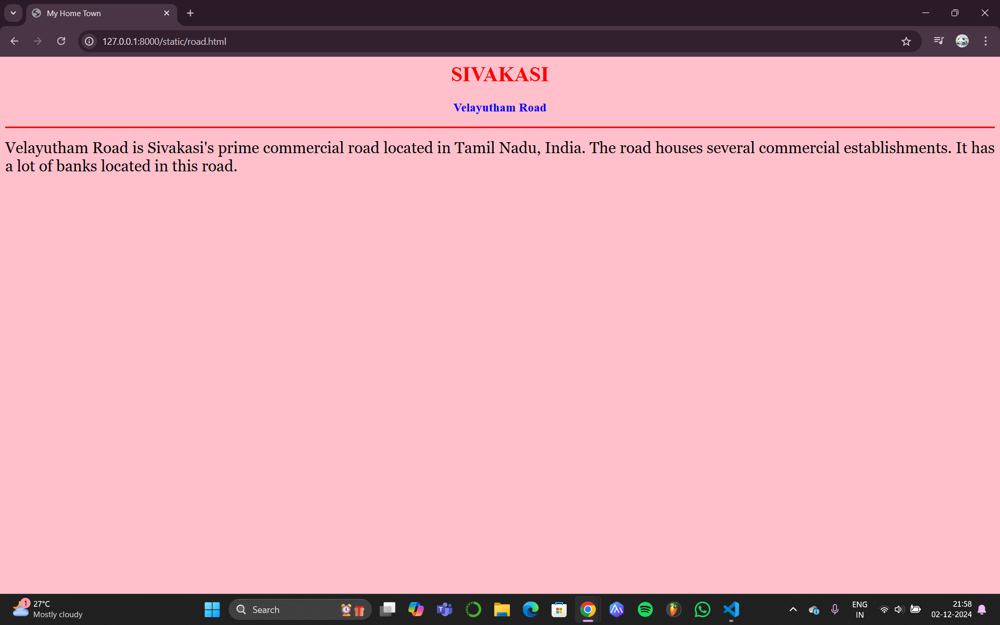
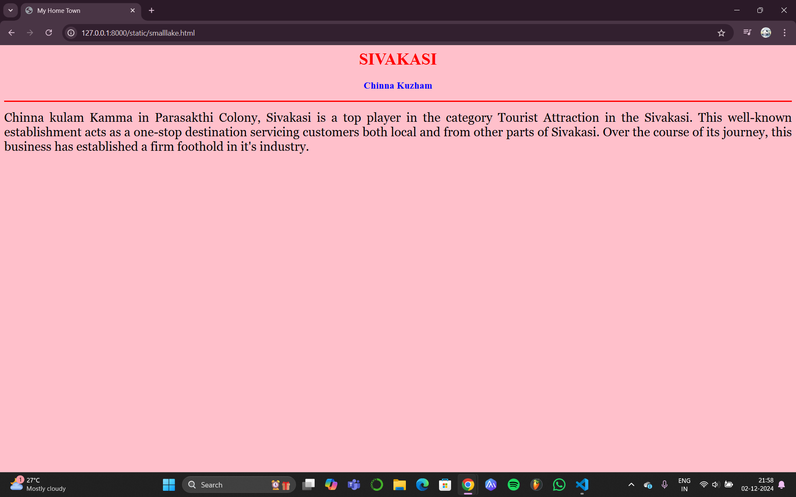
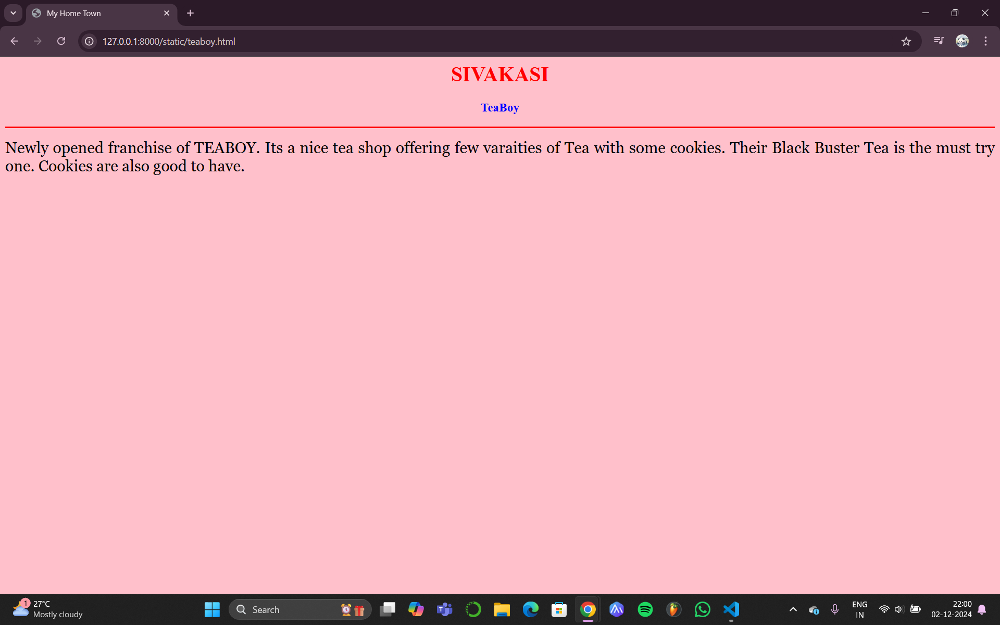
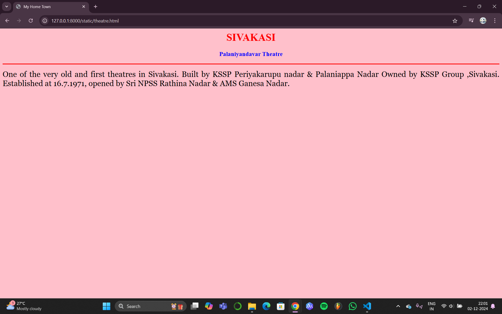

# Ex04 Places Around Me
## Date: 02/12/24

## AIM
To develop a website to display details about the places around my house.

## DESIGN STEPS

### STEP 1
Create a Django admin interface.

### STEP 2
Download your city map from Google.

### STEP 3
Using ```<map>``` tag name the map.

### STEP 4
Create clickable regions in the image using ```<area>``` tag.

### STEP 5
Write HTML programs for all the regions identified.

### STEP 6
Execute the programs and publish them.

## CODE
```
map.html

<html>
<head>
<title>My City</title>
</head>
<body>
<h1 align="center">
<font color="red"><b>SIVAKASI</b></font> 
</h1>
<h3 align="center">
<font color="blue"><b>Akshay Karthick ASR (24002815)</b></font> 
</h3>
<center>

<map name="MyCity">
<area shape="rect" coords="1401,679,1276,767" href="home.html" title="Home Town"> 
<area shape="rect" coords="1240,465,1023,601" href="smalllake.html" title="ChinnaKulam" >
<area shape="rect" coords="1298,357,961,421" href="road.html" title="Velayudham Road" >
<area shape="rect" coords="1125,735,969,803" href="teaboy.html" title="TeaBoy" >
<area shape="rect" coords="1460,565,1304,633" href="theatre.html" title="Palaniyandavar Theatre" >
</map>
</center>
</body>
</html>

home.html

<html>
<head>
<title>My Home Town</title>
</head>
<body bgcolor="pink">
<h1 align="center">
<font color="red"><b>SIVAKASI</b></font> </h1>
<h3 align="center">
<font color="blue"><b>My Home Town</b></font>
</h3>
<hr size="3" color="red">
<p align="justify">
<font face="Georgia" size="5">
    Sivakasi is known as Kutty Japan and also Cracker City.
    Sivakasi is a city in Virudhunagar District in the Indian state of Tamil Nadu. 
    The city is known for firecrackers and match factories that produce 70% of the country's produce. 
    The printing industries in Sivakasi produce 30% of the total diaries produced in India.
</p>
</body>
</html>

road.html

<html>
<head>
<title>My Home Town</title>
</head>
<body bgcolor="pink">
<h1 align="center">
<font color="red"><b>SIVAKASI</b></font> </h1>
<h3 align="center">
<font color="blue"><b>Velayutham Road</b></font>
</h3>
<hr size="3" color="red">
<p align="justify">
<font face="Georgia" size="5">
    Velayutham Road is Sivakasi's prime commercial road located in Tamil Nadu, India. 
    The road houses several commercial establishments.
    It has a lot of banks located in this road.
</p>
</body>
</html>

smalllake.html

<html>
<head>
<title>My Home Town</title>
</head>
<body bgcolor="pink">
<h1 align="center">
<font color="red"><b>SIVAKASI</b></font> </h1>
<h3 align="center">
<font color="blue"><b>Chinna Kuzham</b></font>
</h3>
<hr size="3" color="red">
<p align="justify">
<font face="Georgia" size="5">
    
Chinna kulam Kamma in Parasakthi Colony, Sivakasi is a top player in the category Tourist Attraction in the Sivakasi.
This well-known establishment acts as a one-stop destination servicing customers both local and from other parts of Sivakasi. 
Over the course of its journey, this business has established a firm foothold in it's industry. 
</p>
</body>
</html>

teaboy.html

<html>
<head>
<title>My Home Town</title>
</head>
<body bgcolor="pink">
<h1 align="center">
<font color="red"><b>SIVAKASI</b></font> </h1>
<h3 align="center">
<font color="blue"><b>TeaBoyclear</b></font>
</h3>
<hr size="3" color="red">
<p align="justify">
<font face="Georgia" size="5">
Newly opened franchise of TEABOY.   
Its a nice tea shop offering few varaities of Tea with some cookies. 
Their Black Buster Tea is the must try one. Cookies are also good to have.
</p>
</body>
</html>

theatre.html

<html>
<head>
<title>My Home Town</title>
</head>
<body bgcolor="pink">
<h1 align="center">
<font color="red"><b>SIVAKASI</b></font> </h1>
<h3 align="center">
<font color="blue"><b>Palaniyandavar Theatre</b></font>
</h3>
<hr size="3" color="red">
<p align="justify">
<font face="Georgia" size="5">
    One of the very old and first theatres in Sivakasi.
    Built by KSSP Periyakarupu nadar & Palaniappa Nadar Owned by KSSP Group ,Sivakasi.
    Established at 16.7.1971, opened by Sri NPSS Rathina Nadar & AMS Ganesa Nadar.
</p>
</body>
</html>

```

## OUTPUT







## RESULT
The program for implementing image maps using HTML is executed successfully.
